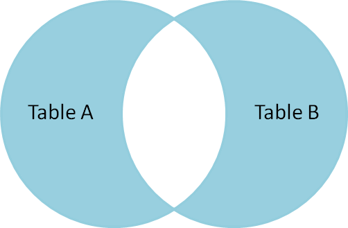

<a id="toc"></a>
# SQL Server notes
<div style="position:fixed;top:0;width:100%;text-align:center;z-index:1">
    <a href="#toc" style="position:relative;z-index:1">Back to Top ↑</a>
</div>

## Table of Contents
0. [Database/Tables](#dbtable)
   1. [Database](#database)
   2. [Table](#table)
1. [Datatypes](#datatypes)
	1. [String data types](#stringdt)
	2. [Number data types](#numberdt)
	3. [Date data types](#datedt)
   	4. [Other data types ](#otherdt)
2. [Properties/Constraints](#procon)
	1. [Common Properties](#properties)
	2. [Constraints](#constraints)
3. [Select/Sets/ResultSet](#select)
   1. [DISTINCT](#sdistinct)
   2. [TOP/TOP PERCENT/WITH TIES](#stopnmore)   
   3. [Set Operations](#soperations)
        1. [UNION/UNIONALL](#sintersect)
        2. [INTERSECT](#sintersect)
        2. [EXCEPT](#sintersect)
4. [Where](#where)
   1. [Operators/Conditions](#woperators)
5. [Order By](#orderby)
6. [Offset/Fetch](#offset)
7. [Modifying Records](#modify)
   1. [INSERT](#insert)
   2. [UPDATE](#update)
   3. [DELETE](#delete)
8. [Functions](#functions)
   1. [Aggregate Functions](#faggregate)
        1. [MIN()](#fmin)
        2. [MAX()](#fmax)
        3. [COUNT()](#fcount)
        4. [AVG()](#favg)
        5. [SUM()](#sum)
    2. [String Functions](#fstring)
        1. [SUBSTRING()](#fsubstring)
        2. [LEN()](#flen)
9. [Alias](#alias)
10. [Joins](#joins)
    1. [INNER](#jinner)
    2. [FULL OUTER](#jfullouter)
    3. [LEFT OUTER](#jleftouter)
    4. [LEFT UNIQUE](#jleftunique)
    5. [OUTER UNIQUE](#jouterunique)
11. [Group by](#groupby)
    1. [HAVING](#having)
<a id="database"></a>
## Datebase/Tables

<a id="database"></a>
### Database
#### Create DB
```SQL
CREATE DATABASE db_name;
```

#### Drop DB
```SQL
DROP DATABASE db_name;
```

#### Backup DB
```SQL
BACKUP DATABASE db_name;
TO DESK = './filepath/backup.bak'
WITH DIFFERENTIAL; -- This makes a backup with only changed parts but FK IT
```

<a id="table"></a>
### Table
#### Create Table
```SQL
CREATE TABLE table_name (
    col_one datatype properties/constraints,
    col_two datatype properties/constraints,
    col_three datatype properties/constraints,
);
```

#### Drop/Truncate Table 
```SQL
DROP|TRUNCATE TABLE table_name;
```

#### Alter Table

##### Add Column
```SQL
ALTER TABLE table_name
ADD col_name datatype;
```

##### Drop Column
```SQL
ALTER TABLE table_name
DROP COLUMN col_name;
```

##### Alter Column
```SQL
ALTER TABLE table_name
ALTER COLUMN col_name dataype;
```

<a id="datatypes"></a>
## Data types

<a id="stringdt"></a>
### String data types
| Data type          | Description                                    | Max size             | Storage                  |
|--------------------|------------------------------------------------|----------------------|--------------------------|
| **char(n)**        | Fixed width chracter string. Default *n* is 1. | 8,000 characters     | Defined width            |
| **varchar(n)**     | Variable width character string.               | 8,000 characters     | 2 bytes + number of char |
| **varchar(max)**   | Variable width character string.               | 1.073 bil characters | 2 bytes + number of char |
| **text**           | Variable width character string.               | 2GB of text data     | 4 bytes + number of char |
| **nchar(n)**       | Fixed width unicode string. Default *n* is 1.  | 4,000 characters     | Defined width x 2        |
| **nvarchar(n)**    | Variable width unicode string.                 | 4,000 characters     |                          |
| **nvarchar(max)**  | Variable width unicode string.                 | 536 mil characters   |                          |
| **ntext**          | Variable width unicode string.                 | 2GB of text data     |                          |
| **binary(n)**      | Fixed width binary string.                     | 8,000 bytes          |                          |
| **varbinary(n)**   | Variable width binary string.                  | 8,000 bytes          |                          |
| **varbinary(max)** | Variable width binary string.                  | 2GB                  |                          |
| **image**          | Variable width binary string.                  | 2GB                  |                          |

<a id="numberdt"></a>
### Number data types
| Data type         | Description                                 | Storage    |
|-------------------|---------------------------------------------|------------|
| **bit**           | Integer that can be 0, 1, or NULL.          |            |
| **tinyint**       | Whole Number 0 -to 255.                     | 1 byte     |
| **smallint**      | Whole Number -/+32,767.                     | 2 bytes    |
| **int**           | Whole Number -/+2.1 bil.                    | 4 bytes    |
| **bigint**        | Reall big whole number                      | 8 bytes    |
| **decimal(p, s)** | Fixed precision and scale numbers.          | 5-17 bytes |
| **numeric(p, s)** | Fixed precision and scale numbers.          | 5-17 bytes |
| **smallmoney**    | Monetary data -/+214,748.3647               |            |
| **money**         | Really big Monetary data                    |            |
| **float(n)**      | Really really big floating precision number |            |
| **real**          | Really really big floating precision number |            |

<a id="datedt"></a>
### Date data types
| Data type          | Description                                                                                                                                                                                                                         | Storage    |
|--------------------|-------------------------------------------------------------------------------------------------------------------------------------------------------------------------------------------------------------------------------------|------------|
| **datetime**       | From January 1, 1753 to December 31, 9999 with an accuracy of 3.33   milliseconds                                                                                                                                                   | 8 bytes    |
| **datetime2**      | From January 1, 0001 to December 31, 9999 with an accuracy of 100   nanoseconds                                                                                                                                                     | 6-8 bytes  |
| **smalldatetime**  | From January 1, 1900 to June 6, 2079 with an accuracy of 1 minute                                                                                                                                                                   | 4 bytes    |
| **date**           | From January 1, 1900 to June 6, 2079 with an accuracy of 1 minute                                                                                                                                                                   | 3 bytes    |
| **time**           | Store a time only to an accuracy of 100 nanoseconds                                                                                                                                                                                 | 3-5 bytes  |
| **datetimeoffset** | The same as datetime2 with the addition of a time zone offset                                                                                                                                                                       | 8-10 bytes |
| **timestamp**      | Stores a unique number that gets   updated every time a row gets created or modified. The timestamp value is   based upon an internal clock and does not correspond to real time. Each table   may have only one timestamp variable |            |

<a id="otherdt"></a>
### Other data types
| Data type            | Description                                                                                 |
|----------------------|---------------------------------------------------------------------------------------------|
| **sql_variant**      | Stores up to 8,000 bytes of data of various data types, except text,   ntext, and timestamp |
| **uniqueidentifier** | Stores a globally unique identifier (GUID)                                                  |
| **xml**              | Stores XML formatted data. Maximum 2GB                                                      |
| **cursor**           | Stores a reference to a cursor used for database operations                                 |
| **table**            | Stores a result-set for later processing                                                    |

<a id="procon"></a>
## Properties/Constraints

<a id="properties"></a>
### Common Properties
| Property Name      | Description                                                                            |
|--------------------|----------------------------------------------------------------------------------------|
| **Identity(s, i)** | Create auto incrementing column for table. *s* is the seed and *i* is the   increment. |

<a id="constraints"></a>
### Constraints
| Constraint Name     | Description                                                                                                                                          |
|---------------------|------------------------------------------------------------------------------------------------------------------------------------------------------|
| **NOT NULL**        | Forces you to provide a valid NOT NULL value in INSERT and UPDATE   statements.                                                                      |
| **UNIQUE**          | Ensures no duplicate values are inserted into a column                                                                                               |
| **PRIMARY KEY**     | Cannot accept NULL value and must be UNIQUE.                                                                                                         |
| **FOREIGN KEY**     | Requires value reference to parent table. `FOREIGN KEY REFERENCES   parent_table(parent_table_column)`                                               |
| **CHECK**           | Limits range of values that can be inserted. `col_name INT CHECK   (col_name >= 0)` OR `CONSTRAINT CHK_col CHECK (col_one > 0 AND col_two   = 'ex')` |
| **DEFAULT**         | Provide default column value if no value specified. `col_name DATETIME   DEFAULT GETDATE()`                                                          |

<a id="select"></a>
## Select
The SELECT statement is used to select and returns data from a DB in a result table(result-set)

#### Single Column
```SQL
SELECT col_1 FROM table_1 -- returns all of col_1 from table_1
```
#### Multiple Columns
```SQL
SELECT col_1, col_2 FROM table_1 -- returns all of col_1 and col_2 from table_1
```
#### All Columns
```SQL
SELECT * FROM table_1 -- returns all columns from table_1
```
<a id="sdistinct"></a>
### DISTINCT
```SQL
SELECT DISTINCT col_1 FROM table_1 -- returns columns with distinct/different values from table 1
```
<a id="stopnmore"></a>
### TOP/TOP PERCENT/WITH TIES
```SQL
SELECT TOP 5 * FROM table_1 -- returns top 5 rows from table_1
```
```SQL
SELECT TOP 50 PERCENT * FROM table_1 -- returns top 50 perecent from table_1
```

<a id="soperations">
### Set Operations
Allows results-set to be combined into a single result set

https://en.wikipedia.org/wiki/Set_operations_(SQL)

<a id="sunion"></a>
#### UNION/UNION ALL
UNION is used to combine the result sets of 2 or more SELECT statements. Must have same # of expressions, and data types, removes duplicate rows.
```SQL
SELECT expression(s)
FROM tables
WHERE condition
UNION
SELECT expression(s)
FROM tables
WHERE condition
```
*** Use `UNION ALL` if you don't want to remove duplicates.

<a id="sintersect"></a>
#### INTERSECT
Like UNION but only returns common records.
```SQL
SELECT expression(s)
FROM tables
WHERE condition
INTERSECT
SELECT expression(s)
FROM tables
WHERE condition
```

<a id="sexcept"></a>
#### EXCEPT
Like UNION but only returns uncommon records.
```SQL
SELECT expression(s)
FROM tables
WHERE condition
EXCEPT
SELECT expression(s)
FROM tables
WHERE condition
```

<a id="sexcept"></a>
#### EXCEPT

<a id="where"></a>
## Where
WHERE is used to filter and extract records the fulfilll a specified condition.
```SQL
SELECT * FROM table_name
WHERE condition;
```

<a id="woperators"></a>
### Operators/Conditions
| Operator Name | Description                                                                                                                                    | Example                                                                                                                                                                              |
|---------------|------------------------------------------------------------------------------------------------------------------------------------------------|--------------------------------------------------------------------------------------------------------------------------------------------------------------------------------------|
| **=**         | Equal                                                                                                                                          |                                                                                                                                                                                      |
| **<>**        | Not Equal. Can also use `!=`. `!>` and `!<` also exist but like... why?                                                                        |                                                                                                                                                                                      |
| **>**         | Greater than                                                                                                                                   |                                                                                                                                                                                      |
| **<**         | Less than                                                                                                                                      |                                                                                                                                                                                      |
| **>=**        | Greater than or equal                                                                                                                          |                                                                                                                                                                                      |
| **<=**        | Less than or equal                                                                                                                             |                                                                                                                                                                                      |
| **BETWEEN**   | Between a certain range. Bottom top and bottom are INCLUSIVE. Works with dates as well `YYYY/MM/DD`                                            | `WHERE col_name BETWEEN val_one AND val_two`                                                                                                                                         |
| **LIKE**      | Search for a pattern. % and _ are wildcards. `%` is like `+` In   regex(0/1/1+).  `_` is like `.`. Also   has `[abc]` and `[^abc]` like regex. | `WHERE col_name LIKE 'a%' Returns all vales that start with a.`                                                                                                                      |
| **IN()**      | To specify multiple possible values for a column                                                                                               | `WHERE col_name IN (val1, val2, val3)`    returns results where col_name is equal to one of the vals. You can   also pass in a `(SELECT statement)` instead of` (val1, val2, val3)`. |
| **AND**       | Returns record if all conditions separated by AND is true                                                                                      | `WHERE condition1 AND condition2`                                                                                                                                                    |
| **OR**        | Return record if any of conditions separated by OR is true                                                                                     | `WHERE condition1 OR condition2`                                                                                                                                                     |
| **NOT**       | Displays record if conditions is false                                                                                                         | `WHERE NOT condition1`                                                                                                                                                               |
| **IS**        | Used for seeing if = null? AKA `IS NULL` or `IS NOT NULL`                                                                                      | `WHERE col_name IS NULL`                                                                                                                                                             |
| **EXISTS**    | Condition is met if subquery returns at least one row. THIS IS INEFFICENT THOUGH                                                               | `WHERE EXISTS (subquery)                                                                                                                                                             |

<a id="orderby"></a>
## Order By
Used to sort result-set in ascending or descending order
```SQL
SELECT col_one FROM table_name
ORDER BY col_one, col_two ASC|DESC;
```
```SQL
SELECT col_one FROM table_name
ORDER BY col_one ASC, col_two DESC;
```

<a id="offset"></a>
## Offset/Fetch
```SQL
SELECT col_name(s)
FROM table_name
ORDER BY col_name(s) -- Required
OFFSET n ROWS
FETCH NEXT m ROWS ONLY -- Optional
```

<a id="modify"></a>
## Modifying Records

<a id="insert"></a>
#### Insert
Inserts records into a table. Duh.
```SQL
INSERT INTO table_name (
	col_one,
	col_two,
	col_three
)
VALUES
	(val1_1, val1_2, val1_3),
	(val2_1, val2_2, val2_3),
```
Insert with default values
```SQL
INSERT INTO table_name (
    col_one,
    col_two,
    col_three
)
DEFAULT VALUES;
```
Insert using sub-select.
```SQL
INSERT [ TOP(top_value) [PERCENT]]
INTO table_name (
    col_one,
    col_two,
    col_three
)
SELECT expression
FROM source_table
WHERE conditions
```

<a id="update"></a>
#### Update
UPDATE is used to modify the existing records in a table.

**IMPORTANT!** If you use UPDATE without using WHERE you are going to have a BAD TIME.
```SQL
UPDATE table_name
SET col1 = val1, col2 = val2, col3 = val3
WHERE condition
```
Update using sub-select
```SQL
UPDATE table1
SET col1 = (SELECT first_name
            FROM table2
            WHERE condition)
WHERE condition;
```
Update using join
```SQL
UPDATE table1 t1
SET t1.col1 = t2.col1
FROM t1
INNER JOIN t2
ON (t1.col2 = t2.col2)
WHERE condition
```

<a id="delete"></a>
#### Delete
DELETE is used to delete existing records in a table. Duh.

**IMPORTANT!** If you use DELETE without using WHERE you are going to have a BAD TIME.
```SQL
DELETE FROM table_name
WHERE condition
```

<a id="functions"></a>
## Functions

<a id="faggregate"></a>
### Aggregate functions

<a id="fmin"></a>
#### MIN()
Returns smallest value of selected column
```SQL
SELECT MIN(col_name) FROM table_name
WHERE condition;
```

<a id="fmax"></a>
#### MAX()
Returns largest value of the selected column
```SQL
SELECT MAX(col_name) FROM table_name
WHERE condition;
```

<a id="fcount"></a>
#### COUNT()
Returns number of rows that matches a specifed condition
```SQL
SELECT COUNT(col_name) FROM table_name
WHERE condition;
```

<a id="favg"></a>
#### AVG()
Returns average value of a nemeric column
```SQL
SELECT AVG(col_name) FROM table_name
WHERE condition;
```

<a id="fsum"></a>
#### SUM()
Returns total sum of a numeric column
```SQL
SELECT SUM(col_name) FROM table_name
WHERE condition;
```

<a id="fstring"></a>
### String functions

<a id="fsubstring"></a>
#### SUBSTRING()
```SQL
SUBSTRING(string, start, length)
```

<a id="flen"></a>
#### LEN()
```SQL
LEN(string)
```

<a id="alias"></a>
## Alias
#### Basic Alias
Gives a column or table a temporary name
```SQL
SELECT col_name as col_alias
FROM table_name as table_alias
```
#### Combining Columns as an Alias
```SQL
SELECT col_one + ',' + col_two + ',' + col_three
FROM table_name
```

<a id="joins"></a>
## Joins
https://blog.codinghorror.com/a-visual-explanation-of-sql-joins/

<a id="jinner"></a>
#### INNER

```SQL
SELECT * FROM TableA
INNER JOIN TableB
ON TableA.name = TableB.name
```

<a id="jfullouter"></a>
#### FULL OUTER

```SQL
SELECT * FROM TableA
FULL OUTER JOIN TableB
ON TableA.name = TableB.name
```

<a id="jleftouter"></a>
#### LEFT OUTER

```SQL
SELECT * FROM TableA
LEFT OUTER JOIN TableB
ON TableA.name = TableB.name
```

<a id="jleftunique"></a>
#### LEFT UNIQUE

```SQL
SELECT * FROM TableA
LEFT OUTER JOIN TableB
ON TableA.name = TableB.name
WHERE TableB.id IS null
```

<a id="jouterunique"></a>
#### OUTER UNIQUE

```SQL
SELECT * FROM TableA
FULL OUTER JOIN TableB
ON TableA.name = TableB.name
WHERE TableA.id IS null
OR TableB.id IS null
```

<a id="groupby"></a>
## Group By
GROUP BY is often used with aggregate functions (COUNT, MAX, MIN, SUM, AVG) to group the result-set.
```SQL
SELECT col_name(s)
FROM table_name
GROUP BY col_name(s)
```

<a id="having"></a>
#### HAVING
HAVING filters the group results created by GROUP BY
```SQL
SELECT expression
FROM table_name
GROUP BY col_name(s)
HAVING condition --EX count(col_name)
```

## Other stuff
#### Things to look into:
- ROW NUMBER
- GO/Batch termination
- Transactions/commit/rollbacks
- Rollbacks
- FOREIGN KEYS > ON UPDATE/DELETE > CASCADE/NO ACTION/SET NULL/SET DEFAULT
- Stored procedures
- Triggers
- GETDATE()
- Self joins
- Insert DEFAULT VALUES
- TRUNCATE - WITH PARTITIONS
- PIVOT
- CASE
- IF_ELSE
- IIF (Ternary)
- CAST/CONVERT (DATETIME)